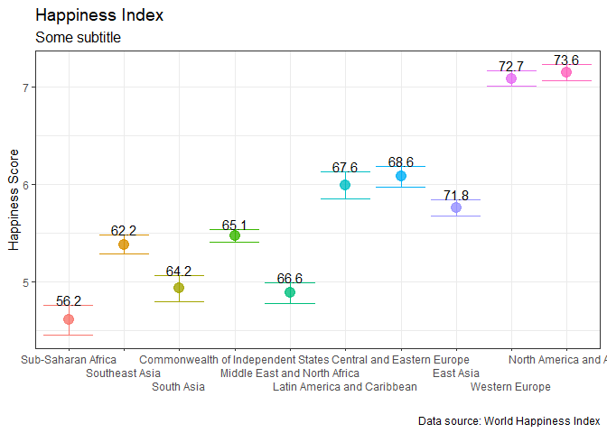
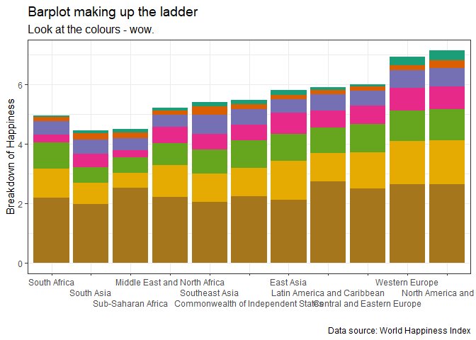
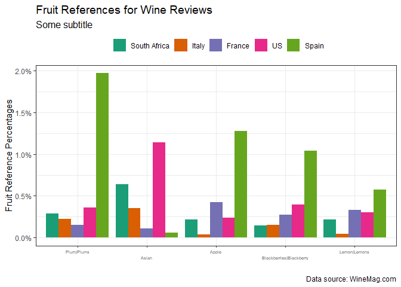
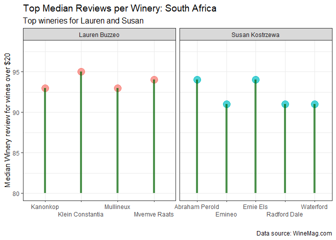
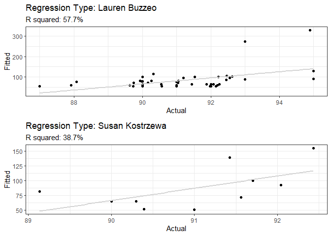

# Purpose

This folder is a suggested solution to the mock assignment. This README
is not as detailed as you can go - I want to get across the code and
loading it, more than the description of what I do.

I want you to note how I construct this folder - creating functions for
all the operations, placing them in the code folders in each question
and sourcing them where appropriate.

You don’t have to follow this exact workflow, but there is merits in
keeping your questions and their code in separate folders.

This README (the root’s README), however, is the one that I will be
looking at and grading. So ensure your codes are sourced in here
appropriately and figures and / or tables displayed here properly.

Convince yourself about how and why I do what I do in this folder- no
memorizing please, it must make sense.

The idea is that each Question’s folder works on a standalone basis -
with the root folder collating it all and detailing what happens in each
question.

> Please make sure that you understand how to create the Texevier html
> and pdf templates.

### How to get started

I used the following code to start off:

``` r
CHOSEN_LOCATION <- "C:/Users/nico/DataScience/Mock_Assignment/"
fmxdat::make_project(FilePath = glue::glue("{CHOSEN_LOCATION}Solution/"), 
                     ProjNam = "14623579")

Texevier::create_template(directory = glue::glue("{CHOSEN_LOCATION}Solution/14623579/"), template_name = "Question1")
Texevier::create_template(directory = glue::glue("{CHOSEN_LOCATION}Solution/14623579/"), template_name = "Question2")
```

# Question 1 solution

Note - try not to spend too much time on the write-up part. I just want
to check the formatting and layout, and whether you can successfully
write something in Texevier. Focus on the data-wrangling, function
building and sourcing and the visuals. It is less of an essay, more of a
show of your ability to use Texevier.

## Code used for Figures and Tables

You must detail the steps in building your Texevier pdf as below.

``` r
rm(list = ls()) # Cleans environment
gc() # garbage collection - It can be useful to call gc after a large object has been removed, as this may prompt R to return memory to the operating system.
```

    ##           used (Mb) gc trigger (Mb) max used (Mb)
    ## Ncells  556052 29.7    1237695 66.2   702048 37.5
    ## Vcells 1056174  8.1    8388608 64.0  1927556 14.8

``` r
library(pacman)
p_load(tidyverse, lubridate)

# Source in all your functions:
# walk is the 'silent' version of map, which is similar to lapply.
list.files('Question1/code/', full.names = T, recursive = T) %>% as.list() %>% walk(~source(.))
```

### Data

I put the unzipped data files in their respective question folders.

For loading in the README - adjust the code.

### Question 1

#### Loading the data

``` r
# See why the parameter Datroot was useful now?
datcolat <- Data_Collating(Datroot = "Question1/Data/Happy/")
```

#### First plot

I can describe this plot as follows…

It shows that ….

For the below, I had to adjust the sizes to fit into the readme a bit.

``` r
g <- Error_bar_plot(datcolat, xaxis_size = 9, xaxis_rows = 3)
```

    ## Warning: The `<scale>` argument of `guides()` cannot be `FALSE`. Use "none" instead as
    ## of ggplot2 3.3.4.
    ## This warning is displayed once every 8 hours.
    ## Call `lifecycle::last_lifecycle_warnings()` to see where this warning was
    ## generated.

``` r
g
```



The second plot in the paper …

``` r
  g <-  Barplot_breakdown_Happy_Contributors(datcolat, Title = "Barplot making up the ladder", Subtitle = "Look at the colours - wow.", xaxis_size = 9, xaxis_rows = 3)
    
g
```



### Question 2

``` r
if(!require("tidyverse")) install.packages("tidyverse")
library(tidyverse)

list.files('Question1/code/', full.names = T, recursive = T) %>% as.list() %>% walk(~source(.))
list.files('Question2/code/', full.names = T, recursive = T) %>% as.list() %>% walk(~source(.))

# Data loading:
    Loc <- "Question2/data/Wine/"
    dff <- read_rds(glue::glue("{Loc}WineMag.rds"))
    Fruitlist <- read_table("Question2/data/wine/Fruitlist.txt")
```

    ## 
    ## ── Column specification ────────────────────────────────────────────────────────
    ## cols(
    ##   Fruits = col_character()
    ## )

    ## Warning: 5 parsing failures.
    ## row col  expected    actual                                file
    ##   3  -- 1 columns 2 columns 'Question2/data/wine/Fruitlist.txt'
    ##  13  -- 1 columns 2 columns 'Question2/data/wine/Fruitlist.txt'
    ##  15  -- 1 columns 2 columns 'Question2/data/wine/Fruitlist.txt'
    ##  25  -- 1 columns 2 columns 'Question2/data/wine/Fruitlist.txt'
    ##  31  -- 1 columns 2 columns 'Question2/data/wine/Fruitlist.txt'

``` r
    froots <- Fruitlist$Fruits  %>% unique %>% as.list()
    CountryList <- c("South Africa", "Italy", "France", "US", "Spain")

    dff_adj <- dff %>% filter(country %in% CountryList)
```

### First plot

Some description here would be great.

``` r
fruit_count <- froots %>% map_df(~Fruit_extractor(dff_adj, froots = .))
```

    ## Warning: There were 176 warnings in `summarise()`.
    ## The first warning was:
    ## ℹ In argument: `Ref_froot = sum(grepl(froots, description))/n()`.
    ## ℹ In group 1: `country = "France"`.
    ## Caused by warning in `grepl()`:
    ## ! unable to translate 'The small Beaujolais cru of Chanas is next door to Moulin i<a0> Vent. As this wine shows, it has the same firm structure and ripe fruit. The wine from the cru's chateau is dense, smoky and has plenty of firm tannins. It is a wine to age, so drink from ...' to a wide string
    ## ℹ Run `dplyr::last_dplyr_warnings()` to see the 175 remaining warnings.
    ## There were 176 warnings in `summarise()`.
    ## The first warning was:
    ## ℹ In argument: `Ref_froot = sum(grepl(froots, description))/n()`.
    ## ℹ In group 1: `country = "France"`.
    ## Caused by warning in `grepl()`:
    ## ! unable to translate 'The small Beaujolais cru of Chanas is next door to Moulin i<a0> Vent. As this wine shows, it has the same firm structure and ripe fruit. The wine from the cru's chateau is dense, smoky and has plenty of firm tannins. It is a wine to age, so drink from ...' to a wide string
    ## ℹ Run `dplyr::last_dplyr_warnings()` to see the 175 remaining warnings.
    ## There were 176 warnings in `summarise()`.
    ## The first warning was:
    ## ℹ In argument: `Ref_froot = sum(grepl(froots, description))/n()`.
    ## ℹ In group 1: `country = "France"`.
    ## Caused by warning in `grepl()`:
    ## ! unable to translate 'The small Beaujolais cru of Chanas is next door to Moulin i<a0> Vent. As this wine shows, it has the same firm structure and ripe fruit. The wine from the cru's chateau is dense, smoky and has plenty of firm tannins. It is a wine to age, so drink from ...' to a wide string
    ## ℹ Run `dplyr::last_dplyr_warnings()` to see the 175 remaining warnings.
    ## There were 176 warnings in `summarise()`.
    ## The first warning was:
    ## ℹ In argument: `Ref_froot = sum(grepl(froots, description))/n()`.
    ## ℹ In group 1: `country = "France"`.
    ## Caused by warning in `grepl()`:
    ## ! unable to translate 'The small Beaujolais cru of Chanas is next door to Moulin i<a0> Vent. As this wine shows, it has the same firm structure and ripe fruit. The wine from the cru's chateau is dense, smoky and has plenty of firm tannins. It is a wine to age, so drink from ...' to a wide string
    ## ℹ Run `dplyr::last_dplyr_warnings()` to see the 175 remaining warnings.
    ## There were 176 warnings in `summarise()`.
    ## The first warning was:
    ## ℹ In argument: `Ref_froot = sum(grepl(froots, description))/n()`.
    ## ℹ In group 1: `country = "France"`.
    ## Caused by warning in `grepl()`:
    ## ! unable to translate 'The small Beaujolais cru of Chanas is next door to Moulin i<a0> Vent. As this wine shows, it has the same firm structure and ripe fruit. The wine from the cru's chateau is dense, smoky and has plenty of firm tannins. It is a wine to age, so drink from ...' to a wide string
    ## ℹ Run `dplyr::last_dplyr_warnings()` to see the 175 remaining warnings.
    ## There were 176 warnings in `summarise()`.
    ## The first warning was:
    ## ℹ In argument: `Ref_froot = sum(grepl(froots, description))/n()`.
    ## ℹ In group 1: `country = "France"`.
    ## Caused by warning in `grepl()`:
    ## ! unable to translate 'The small Beaujolais cru of Chanas is next door to Moulin i<a0> Vent. As this wine shows, it has the same firm structure and ripe fruit. The wine from the cru's chateau is dense, smoky and has plenty of firm tannins. It is a wine to age, so drink from ...' to a wide string
    ## ℹ Run `dplyr::last_dplyr_warnings()` to see the 175 remaining warnings.
    ## There were 176 warnings in `summarise()`.
    ## The first warning was:
    ## ℹ In argument: `Ref_froot = sum(grepl(froots, description))/n()`.
    ## ℹ In group 1: `country = "France"`.
    ## Caused by warning in `grepl()`:
    ## ! unable to translate 'The small Beaujolais cru of Chanas is next door to Moulin i<a0> Vent. As this wine shows, it has the same firm structure and ripe fruit. The wine from the cru's chateau is dense, smoky and has plenty of firm tannins. It is a wine to age, so drink from ...' to a wide string
    ## ℹ Run `dplyr::last_dplyr_warnings()` to see the 175 remaining warnings.
    ## There were 176 warnings in `summarise()`.
    ## The first warning was:
    ## ℹ In argument: `Ref_froot = sum(grepl(froots, description))/n()`.
    ## ℹ In group 1: `country = "France"`.
    ## Caused by warning in `grepl()`:
    ## ! unable to translate 'The small Beaujolais cru of Chanas is next door to Moulin i<a0> Vent. As this wine shows, it has the same firm structure and ripe fruit. The wine from the cru's chateau is dense, smoky and has plenty of firm tannins. It is a wine to age, so drink from ...' to a wide string
    ## ℹ Run `dplyr::last_dplyr_warnings()` to see the 175 remaining warnings.
    ## There were 176 warnings in `summarise()`.
    ## The first warning was:
    ## ℹ In argument: `Ref_froot = sum(grepl(froots, description))/n()`.
    ## ℹ In group 1: `country = "France"`.
    ## Caused by warning in `grepl()`:
    ## ! unable to translate 'The small Beaujolais cru of Chanas is next door to Moulin i<a0> Vent. As this wine shows, it has the same firm structure and ripe fruit. The wine from the cru's chateau is dense, smoky and has plenty of firm tannins. It is a wine to age, so drink from ...' to a wide string
    ## ℹ Run `dplyr::last_dplyr_warnings()` to see the 175 remaining warnings.
    ## There were 176 warnings in `summarise()`.
    ## The first warning was:
    ## ℹ In argument: `Ref_froot = sum(grepl(froots, description))/n()`.
    ## ℹ In group 1: `country = "France"`.
    ## Caused by warning in `grepl()`:
    ## ! unable to translate 'The small Beaujolais cru of Chanas is next door to Moulin i<a0> Vent. As this wine shows, it has the same firm structure and ripe fruit. The wine from the cru's chateau is dense, smoky and has plenty of firm tannins. It is a wine to age, so drink from ...' to a wide string
    ## ℹ Run `dplyr::last_dplyr_warnings()` to see the 175 remaining warnings.
    ## There were 176 warnings in `summarise()`.
    ## The first warning was:
    ## ℹ In argument: `Ref_froot = sum(grepl(froots, description))/n()`.
    ## ℹ In group 1: `country = "France"`.
    ## Caused by warning in `grepl()`:
    ## ! unable to translate 'The small Beaujolais cru of Chanas is next door to Moulin i<a0> Vent. As this wine shows, it has the same firm structure and ripe fruit. The wine from the cru's chateau is dense, smoky and has plenty of firm tannins. It is a wine to age, so drink from ...' to a wide string
    ## ℹ Run `dplyr::last_dplyr_warnings()` to see the 175 remaining warnings.
    ## There were 176 warnings in `summarise()`.
    ## The first warning was:
    ## ℹ In argument: `Ref_froot = sum(grepl(froots, description))/n()`.
    ## ℹ In group 1: `country = "France"`.
    ## Caused by warning in `grepl()`:
    ## ! unable to translate 'The small Beaujolais cru of Chanas is next door to Moulin i<a0> Vent. As this wine shows, it has the same firm structure and ripe fruit. The wine from the cru's chateau is dense, smoky and has plenty of firm tannins. It is a wine to age, so drink from ...' to a wide string
    ## ℹ Run `dplyr::last_dplyr_warnings()` to see the 175 remaining warnings.
    ## There were 176 warnings in `summarise()`.
    ## The first warning was:
    ## ℹ In argument: `Ref_froot = sum(grepl(froots, description))/n()`.
    ## ℹ In group 1: `country = "France"`.
    ## Caused by warning in `grepl()`:
    ## ! unable to translate 'The small Beaujolais cru of Chanas is next door to Moulin i<a0> Vent. As this wine shows, it has the same firm structure and ripe fruit. The wine from the cru's chateau is dense, smoky and has plenty of firm tannins. It is a wine to age, so drink from ...' to a wide string
    ## ℹ Run `dplyr::last_dplyr_warnings()` to see the 175 remaining warnings.
    ## There were 176 warnings in `summarise()`.
    ## The first warning was:
    ## ℹ In argument: `Ref_froot = sum(grepl(froots, description))/n()`.
    ## ℹ In group 1: `country = "France"`.
    ## Caused by warning in `grepl()`:
    ## ! unable to translate 'The small Beaujolais cru of Chanas is next door to Moulin i<a0> Vent. As this wine shows, it has the same firm structure and ripe fruit. The wine from the cru's chateau is dense, smoky and has plenty of firm tannins. It is a wine to age, so drink from ...' to a wide string
    ## ℹ Run `dplyr::last_dplyr_warnings()` to see the 175 remaining warnings.
    ## There were 176 warnings in `summarise()`.
    ## The first warning was:
    ## ℹ In argument: `Ref_froot = sum(grepl(froots, description))/n()`.
    ## ℹ In group 1: `country = "France"`.
    ## Caused by warning in `grepl()`:
    ## ! unable to translate 'The small Beaujolais cru of Chanas is next door to Moulin i<a0> Vent. As this wine shows, it has the same firm structure and ripe fruit. The wine from the cru's chateau is dense, smoky and has plenty of firm tannins. It is a wine to age, so drink from ...' to a wide string
    ## ℹ Run `dplyr::last_dplyr_warnings()` to see the 175 remaining warnings.
    ## There were 176 warnings in `summarise()`.
    ## The first warning was:
    ## ℹ In argument: `Ref_froot = sum(grepl(froots, description))/n()`.
    ## ℹ In group 1: `country = "France"`.
    ## Caused by warning in `grepl()`:
    ## ! unable to translate 'The small Beaujolais cru of Chanas is next door to Moulin i<a0> Vent. As this wine shows, it has the same firm structure and ripe fruit. The wine from the cru's chateau is dense, smoky and has plenty of firm tannins. It is a wine to age, so drink from ...' to a wide string
    ## ℹ Run `dplyr::last_dplyr_warnings()` to see the 175 remaining warnings.
    ## There were 176 warnings in `summarise()`.
    ## The first warning was:
    ## ℹ In argument: `Ref_froot = sum(grepl(froots, description))/n()`.
    ## ℹ In group 1: `country = "France"`.
    ## Caused by warning in `grepl()`:
    ## ! unable to translate 'The small Beaujolais cru of Chanas is next door to Moulin i<a0> Vent. As this wine shows, it has the same firm structure and ripe fruit. The wine from the cru's chateau is dense, smoky and has plenty of firm tannins. It is a wine to age, so drink from ...' to a wide string
    ## ℹ Run `dplyr::last_dplyr_warnings()` to see the 175 remaining warnings.
    ## There were 176 warnings in `summarise()`.
    ## The first warning was:
    ## ℹ In argument: `Ref_froot = sum(grepl(froots, description))/n()`.
    ## ℹ In group 1: `country = "France"`.
    ## Caused by warning in `grepl()`:
    ## ! unable to translate 'The small Beaujolais cru of Chanas is next door to Moulin i<a0> Vent. As this wine shows, it has the same firm structure and ripe fruit. The wine from the cru's chateau is dense, smoky and has plenty of firm tannins. It is a wine to age, so drink from ...' to a wide string
    ## ℹ Run `dplyr::last_dplyr_warnings()` to see the 175 remaining warnings.
    ## There were 176 warnings in `summarise()`.
    ## The first warning was:
    ## ℹ In argument: `Ref_froot = sum(grepl(froots, description))/n()`.
    ## ℹ In group 1: `country = "France"`.
    ## Caused by warning in `grepl()`:
    ## ! unable to translate 'The small Beaujolais cru of Chanas is next door to Moulin i<a0> Vent. As this wine shows, it has the same firm structure and ripe fruit. The wine from the cru's chateau is dense, smoky and has plenty of firm tannins. It is a wine to age, so drink from ...' to a wide string
    ## ℹ Run `dplyr::last_dplyr_warnings()` to see the 175 remaining warnings.
    ## There were 176 warnings in `summarise()`.
    ## The first warning was:
    ## ℹ In argument: `Ref_froot = sum(grepl(froots, description))/n()`.
    ## ℹ In group 1: `country = "France"`.
    ## Caused by warning in `grepl()`:
    ## ! unable to translate 'The small Beaujolais cru of Chanas is next door to Moulin i<a0> Vent. As this wine shows, it has the same firm structure and ripe fruit. The wine from the cru's chateau is dense, smoky and has plenty of firm tannins. It is a wine to age, so drink from ...' to a wide string
    ## ℹ Run `dplyr::last_dplyr_warnings()` to see the 175 remaining warnings.
    ## There were 176 warnings in `summarise()`.
    ## The first warning was:
    ## ℹ In argument: `Ref_froot = sum(grepl(froots, description))/n()`.
    ## ℹ In group 1: `country = "France"`.
    ## Caused by warning in `grepl()`:
    ## ! unable to translate 'The small Beaujolais cru of Chanas is next door to Moulin i<a0> Vent. As this wine shows, it has the same firm structure and ripe fruit. The wine from the cru's chateau is dense, smoky and has plenty of firm tannins. It is a wine to age, so drink from ...' to a wide string
    ## ℹ Run `dplyr::last_dplyr_warnings()` to see the 175 remaining warnings.
    ## There were 176 warnings in `summarise()`.
    ## The first warning was:
    ## ℹ In argument: `Ref_froot = sum(grepl(froots, description))/n()`.
    ## ℹ In group 1: `country = "France"`.
    ## Caused by warning in `grepl()`:
    ## ! unable to translate 'The small Beaujolais cru of Chanas is next door to Moulin i<a0> Vent. As this wine shows, it has the same firm structure and ripe fruit. The wine from the cru's chateau is dense, smoky and has plenty of firm tannins. It is a wine to age, so drink from ...' to a wide string
    ## ℹ Run `dplyr::last_dplyr_warnings()` to see the 175 remaining warnings.
    ## There were 176 warnings in `summarise()`.
    ## The first warning was:
    ## ℹ In argument: `Ref_froot = sum(grepl(froots, description))/n()`.
    ## ℹ In group 1: `country = "France"`.
    ## Caused by warning in `grepl()`:
    ## ! unable to translate 'The small Beaujolais cru of Chanas is next door to Moulin i<a0> Vent. As this wine shows, it has the same firm structure and ripe fruit. The wine from the cru's chateau is dense, smoky and has plenty of firm tannins. It is a wine to age, so drink from ...' to a wide string
    ## ℹ Run `dplyr::last_dplyr_warnings()` to see the 175 remaining warnings.
    ## There were 176 warnings in `summarise()`.
    ## The first warning was:
    ## ℹ In argument: `Ref_froot = sum(grepl(froots, description))/n()`.
    ## ℹ In group 1: `country = "France"`.
    ## Caused by warning in `grepl()`:
    ## ! unable to translate 'The small Beaujolais cru of Chanas is next door to Moulin i<a0> Vent. As this wine shows, it has the same firm structure and ripe fruit. The wine from the cru's chateau is dense, smoky and has plenty of firm tannins. It is a wine to age, so drink from ...' to a wide string
    ## ℹ Run `dplyr::last_dplyr_warnings()` to see the 175 remaining warnings.
    ## There were 176 warnings in `summarise()`.
    ## The first warning was:
    ## ℹ In argument: `Ref_froot = sum(grepl(froots, description))/n()`.
    ## ℹ In group 1: `country = "France"`.
    ## Caused by warning in `grepl()`:
    ## ! unable to translate 'The small Beaujolais cru of Chanas is next door to Moulin i<a0> Vent. As this wine shows, it has the same firm structure and ripe fruit. The wine from the cru's chateau is dense, smoky and has plenty of firm tannins. It is a wine to age, so drink from ...' to a wide string
    ## ℹ Run `dplyr::last_dplyr_warnings()` to see the 175 remaining warnings.
    ## There were 176 warnings in `summarise()`.
    ## The first warning was:
    ## ℹ In argument: `Ref_froot = sum(grepl(froots, description))/n()`.
    ## ℹ In group 1: `country = "France"`.
    ## Caused by warning in `grepl()`:
    ## ! unable to translate 'The small Beaujolais cru of Chanas is next door to Moulin i<a0> Vent. As this wine shows, it has the same firm structure and ripe fruit. The wine from the cru's chateau is dense, smoky and has plenty of firm tannins. It is a wine to age, so drink from ...' to a wide string
    ## ℹ Run `dplyr::last_dplyr_warnings()` to see the 175 remaining warnings.
    ## There were 176 warnings in `summarise()`.
    ## The first warning was:
    ## ℹ In argument: `Ref_froot = sum(grepl(froots, description))/n()`.
    ## ℹ In group 1: `country = "France"`.
    ## Caused by warning in `grepl()`:
    ## ! unable to translate 'The small Beaujolais cru of Chanas is next door to Moulin i<a0> Vent. As this wine shows, it has the same firm structure and ripe fruit. The wine from the cru's chateau is dense, smoky and has plenty of firm tannins. It is a wine to age, so drink from ...' to a wide string
    ## ℹ Run `dplyr::last_dplyr_warnings()` to see the 175 remaining warnings.
    ## There were 176 warnings in `summarise()`.
    ## The first warning was:
    ## ℹ In argument: `Ref_froot = sum(grepl(froots, description))/n()`.
    ## ℹ In group 1: `country = "France"`.
    ## Caused by warning in `grepl()`:
    ## ! unable to translate 'The small Beaujolais cru of Chanas is next door to Moulin i<a0> Vent. As this wine shows, it has the same firm structure and ripe fruit. The wine from the cru's chateau is dense, smoky and has plenty of firm tannins. It is a wine to age, so drink from ...' to a wide string
    ## ℹ Run `dplyr::last_dplyr_warnings()` to see the 175 remaining warnings.
    ## There were 176 warnings in `summarise()`.
    ## The first warning was:
    ## ℹ In argument: `Ref_froot = sum(grepl(froots, description))/n()`.
    ## ℹ In group 1: `country = "France"`.
    ## Caused by warning in `grepl()`:
    ## ! unable to translate 'The small Beaujolais cru of Chanas is next door to Moulin i<a0> Vent. As this wine shows, it has the same firm structure and ripe fruit. The wine from the cru's chateau is dense, smoky and has plenty of firm tannins. It is a wine to age, so drink from ...' to a wide string
    ## ℹ Run `dplyr::last_dplyr_warnings()` to see the 175 remaining warnings.
    ## There were 176 warnings in `summarise()`.
    ## The first warning was:
    ## ℹ In argument: `Ref_froot = sum(grepl(froots, description))/n()`.
    ## ℹ In group 1: `country = "France"`.
    ## Caused by warning in `grepl()`:
    ## ! unable to translate 'The small Beaujolais cru of Chanas is next door to Moulin i<a0> Vent. As this wine shows, it has the same firm structure and ripe fruit. The wine from the cru's chateau is dense, smoky and has plenty of firm tannins. It is a wine to age, so drink from ...' to a wide string
    ## ℹ Run `dplyr::last_dplyr_warnings()` to see the 175 remaining warnings.
    ## There were 176 warnings in `summarise()`.
    ## The first warning was:
    ## ℹ In argument: `Ref_froot = sum(grepl(froots, description))/n()`.
    ## ℹ In group 1: `country = "France"`.
    ## Caused by warning in `grepl()`:
    ## ! unable to translate 'The small Beaujolais cru of Chanas is next door to Moulin i<a0> Vent. As this wine shows, it has the same firm structure and ripe fruit. The wine from the cru's chateau is dense, smoky and has plenty of firm tannins. It is a wine to age, so drink from ...' to a wide string
    ## ℹ Run `dplyr::last_dplyr_warnings()` to see the 175 remaining warnings.
    ## There were 176 warnings in `summarise()`.
    ## The first warning was:
    ## ℹ In argument: `Ref_froot = sum(grepl(froots, description))/n()`.
    ## ℹ In group 1: `country = "France"`.
    ## Caused by warning in `grepl()`:
    ## ! unable to translate 'The small Beaujolais cru of Chanas is next door to Moulin i<a0> Vent. As this wine shows, it has the same firm structure and ripe fruit. The wine from the cru's chateau is dense, smoky and has plenty of firm tannins. It is a wine to age, so drink from ...' to a wide string
    ## ℹ Run `dplyr::last_dplyr_warnings()` to see the 175 remaining warnings.
    ## There were 176 warnings in `summarise()`.
    ## The first warning was:
    ## ℹ In argument: `Ref_froot = sum(grepl(froots, description))/n()`.
    ## ℹ In group 1: `country = "France"`.
    ## Caused by warning in `grepl()`:
    ## ! unable to translate 'The small Beaujolais cru of Chanas is next door to Moulin i<a0> Vent. As this wine shows, it has the same firm structure and ripe fruit. The wine from the cru's chateau is dense, smoky and has plenty of firm tannins. It is a wine to age, so drink from ...' to a wide string
    ## ℹ Run `dplyr::last_dplyr_warnings()` to see the 175 remaining warnings.
    ## There were 176 warnings in `summarise()`.
    ## The first warning was:
    ## ℹ In argument: `Ref_froot = sum(grepl(froots, description))/n()`.
    ## ℹ In group 1: `country = "France"`.
    ## Caused by warning in `grepl()`:
    ## ! unable to translate 'The small Beaujolais cru of Chanas is next door to Moulin i<a0> Vent. As this wine shows, it has the same firm structure and ripe fruit. The wine from the cru's chateau is dense, smoky and has plenty of firm tannins. It is a wine to age, so drink from ...' to a wide string
    ## ℹ Run `dplyr::last_dplyr_warnings()` to see the 175 remaining warnings.
    ## There were 176 warnings in `summarise()`.
    ## The first warning was:
    ## ℹ In argument: `Ref_froot = sum(grepl(froots, description))/n()`.
    ## ℹ In group 1: `country = "France"`.
    ## Caused by warning in `grepl()`:
    ## ! unable to translate 'The small Beaujolais cru of Chanas is next door to Moulin i<a0> Vent. As this wine shows, it has the same firm structure and ripe fruit. The wine from the cru's chateau is dense, smoky and has plenty of firm tannins. It is a wine to age, so drink from ...' to a wide string
    ## ℹ Run `dplyr::last_dplyr_warnings()` to see the 175 remaining warnings.
    ## There were 176 warnings in `summarise()`.
    ## The first warning was:
    ## ℹ In argument: `Ref_froot = sum(grepl(froots, description))/n()`.
    ## ℹ In group 1: `country = "France"`.
    ## Caused by warning in `grepl()`:
    ## ! unable to translate 'The small Beaujolais cru of Chanas is next door to Moulin i<a0> Vent. As this wine shows, it has the same firm structure and ripe fruit. The wine from the cru's chateau is dense, smoky and has plenty of firm tannins. It is a wine to age, so drink from ...' to a wide string
    ## ℹ Run `dplyr::last_dplyr_warnings()` to see the 175 remaining warnings.
    ## There were 176 warnings in `summarise()`.
    ## The first warning was:
    ## ℹ In argument: `Ref_froot = sum(grepl(froots, description))/n()`.
    ## ℹ In group 1: `country = "France"`.
    ## Caused by warning in `grepl()`:
    ## ! unable to translate 'The small Beaujolais cru of Chanas is next door to Moulin i<a0> Vent. As this wine shows, it has the same firm structure and ripe fruit. The wine from the cru's chateau is dense, smoky and has plenty of firm tannins. It is a wine to age, so drink from ...' to a wide string
    ## ℹ Run `dplyr::last_dplyr_warnings()` to see the 175 remaining warnings.
    ## There were 176 warnings in `summarise()`.
    ## The first warning was:
    ## ℹ In argument: `Ref_froot = sum(grepl(froots, description))/n()`.
    ## ℹ In group 1: `country = "France"`.
    ## Caused by warning in `grepl()`:
    ## ! unable to translate 'The small Beaujolais cru of Chanas is next door to Moulin i<a0> Vent. As this wine shows, it has the same firm structure and ripe fruit. The wine from the cru's chateau is dense, smoky and has plenty of firm tannins. It is a wine to age, so drink from ...' to a wide string
    ## ℹ Run `dplyr::last_dplyr_warnings()` to see the 175 remaining warnings.
    ## There were 176 warnings in `summarise()`.
    ## The first warning was:
    ## ℹ In argument: `Ref_froot = sum(grepl(froots, description))/n()`.
    ## ℹ In group 1: `country = "France"`.
    ## Caused by warning in `grepl()`:
    ## ! unable to translate 'The small Beaujolais cru of Chanas is next door to Moulin i<a0> Vent. As this wine shows, it has the same firm structure and ripe fruit. The wine from the cru's chateau is dense, smoky and has plenty of firm tannins. It is a wine to age, so drink from ...' to a wide string
    ## ℹ Run `dplyr::last_dplyr_warnings()` to see the 175 remaining warnings.
    ## There were 176 warnings in `summarise()`.
    ## The first warning was:
    ## ℹ In argument: `Ref_froot = sum(grepl(froots, description))/n()`.
    ## ℹ In group 1: `country = "France"`.
    ## Caused by warning in `grepl()`:
    ## ! unable to translate 'The small Beaujolais cru of Chanas is next door to Moulin i<a0> Vent. As this wine shows, it has the same firm structure and ripe fruit. The wine from the cru's chateau is dense, smoky and has plenty of firm tannins. It is a wine to age, so drink from ...' to a wide string
    ## ℹ Run `dplyr::last_dplyr_warnings()` to see the 175 remaining warnings.
    ## There were 176 warnings in `summarise()`.
    ## The first warning was:
    ## ℹ In argument: `Ref_froot = sum(grepl(froots, description))/n()`.
    ## ℹ In group 1: `country = "France"`.
    ## Caused by warning in `grepl()`:
    ## ! unable to translate 'The small Beaujolais cru of Chanas is next door to Moulin i<a0> Vent. As this wine shows, it has the same firm structure and ripe fruit. The wine from the cru's chateau is dense, smoky and has plenty of firm tannins. It is a wine to age, so drink from ...' to a wide string
    ## ℹ Run `dplyr::last_dplyr_warnings()` to see the 175 remaining warnings.
    ## There were 176 warnings in `summarise()`.
    ## The first warning was:
    ## ℹ In argument: `Ref_froot = sum(grepl(froots, description))/n()`.
    ## ℹ In group 1: `country = "France"`.
    ## Caused by warning in `grepl()`:
    ## ! unable to translate 'The small Beaujolais cru of Chanas is next door to Moulin i<a0> Vent. As this wine shows, it has the same firm structure and ripe fruit. The wine from the cru's chateau is dense, smoky and has plenty of firm tannins. It is a wine to age, so drink from ...' to a wide string
    ## ℹ Run `dplyr::last_dplyr_warnings()` to see the 175 remaining warnings.
    ## There were 176 warnings in `summarise()`.
    ## The first warning was:
    ## ℹ In argument: `Ref_froot = sum(grepl(froots, description))/n()`.
    ## ℹ In group 1: `country = "France"`.
    ## Caused by warning in `grepl()`:
    ## ! unable to translate 'The small Beaujolais cru of Chanas is next door to Moulin i<a0> Vent. As this wine shows, it has the same firm structure and ripe fruit. The wine from the cru's chateau is dense, smoky and has plenty of firm tannins. It is a wine to age, so drink from ...' to a wide string
    ## ℹ Run `dplyr::last_dplyr_warnings()` to see the 175 remaining warnings.
    ## There were 176 warnings in `summarise()`.
    ## The first warning was:
    ## ℹ In argument: `Ref_froot = sum(grepl(froots, description))/n()`.
    ## ℹ In group 1: `country = "France"`.
    ## Caused by warning in `grepl()`:
    ## ! unable to translate 'The small Beaujolais cru of Chanas is next door to Moulin i<a0> Vent. As this wine shows, it has the same firm structure and ripe fruit. The wine from the cru's chateau is dense, smoky and has plenty of firm tannins. It is a wine to age, so drink from ...' to a wide string
    ## ℹ Run `dplyr::last_dplyr_warnings()` to see the 175 remaining warnings.

``` r
g <- First_fruits_plot(fruit_count, xaxis_rows = 2, xaxis_size = 5)
g
```



### Table

Note that for the table function, I added a Latex argument so that it
can build in html form for use in README.

``` r
Tab <- Term_refs_table(dff_adj, Latex = FALSE)
```

    ## Warning: There were 176 warnings in `summarise()`.
    ## The first warning was:
    ## ℹ In argument: `Percent = sum(grepl(paste(Terms, collapse = "|"),
    ##   description))/n()`.
    ## ℹ In group 1: `country = "France"`.
    ## Caused by warning in `grepl()`:
    ## ! unable to translate 'The small Beaujolais cru of Chanas is next door to Moulin i<a0> Vent. As this wine shows, it has the same firm structure and ripe fruit. The wine from the cru's chateau is dense, smoky and has plenty of firm tannins. It is a wine to age, so drink from ...' to a wide string
    ## ℹ Run `dplyr::last_dplyr_warnings()` to see the 175 remaining warnings.
    ## There were 176 warnings in `summarise()`.
    ## The first warning was:
    ## ℹ In argument: `Percent = sum(grepl(paste(Terms, collapse = "|"),
    ##   description))/n()`.
    ## ℹ In group 1: `country = "France"`.
    ## Caused by warning in `grepl()`:
    ## ! unable to translate 'The small Beaujolais cru of Chanas is next door to Moulin i<a0> Vent. As this wine shows, it has the same firm structure and ripe fruit. The wine from the cru's chateau is dense, smoky and has plenty of firm tannins. It is a wine to age, so drink from ...' to a wide string
    ## ℹ Run `dplyr::last_dplyr_warnings()` to see the 175 remaining warnings.

``` r
Tab
```

| country      | Percent | Term                  |
|:-------------|:--------|:----------------------|
| France       | 26.348% | tannins               |
| Italy        | 37.61%  | tannins               |
| South Africa | 26.981% | tannins               |
| Spain        | 12.22%  | tannins               |
| US           | 19.252% | tannins               |
| France       | 1%      | smoke, smokey and ash |
| Italy        | 3.797%  | smoke, smokey and ash |
| South Africa | 9.565%  | smoke, smokey and ash |
| Spain        | 3.281%  | smoke, smokey and ash |
| US           | 7.876%  | smoke, smokey and ash |

### Second plot

``` r
Tasters <- c( "Lauren Buzzeo" , "Susan Kostrzewa")
df_SA <-
    dff %>% filter(country %in% "South Africa", price > 50, taster_name %in% Tasters)

gg <- Top_5_Wineries_SA_Plot(df_SA, Tasters)
```

    ## Warning: Using `size` aesthetic for lines was deprecated in ggplot2 3.4.0.
    ## ℹ Please use `linewidth` instead.
    ## This warning is displayed once every 8 hours.
    ## Call `lifecycle::last_lifecycle_warnings()` to see where this warning was
    ## generated.

``` r
gg
```



### Regression plot

Short overview

``` r
Regression_Plot(df_SA)
```

    ## Warning: ... is ignored in group_split(<rowwise_df>), please use as_tibble() %>%
    ## group_split(...)



### Question 3

See if you can tackle this question yourself.

### Question 4

See the Question3 folder - I get you started there on a data wrangling
function.

There’s some nice tips and tricks in there, please go through all the
lines.
